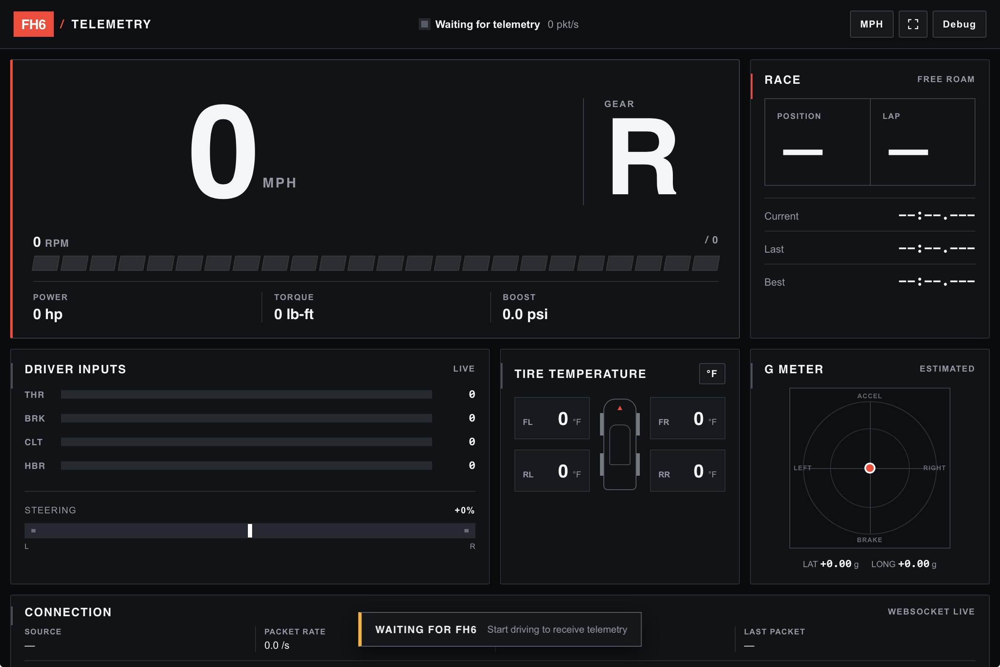

# FH6 Telemetry Display

FH6 Telemetry Display turns Forza Horizon 6 Data Out packets into a live racing
dashboard that can be viewed on the same PC or any device on the local network.
The Windows application runs quietly in the notification area, records driving
sessions in the background, and does not require Python or an installer.



## Features

- Live speed, RPM, gear, throttle, brake, steering, clutch, and handbrake data
- G-force, acceleration, position, lap, race, drivetrain, and vehicle data
- Individual tire temperature, slip, suspension, and wheel readings
- Responsive dashboard for desktop, mobile, and landscape tablets
- Per-device dashboard customization with saved colors, panel order, and data visibility
- Digital and analog speedometer modes with an optional realtime system clock
- Windows notification-area application with no console window
- Left-click Settings and right-click quick actions
- Local dashboard, LAN dashboard, and debug-page shortcuts
- Automatic LAN IPv4 detection with virtual/VPN adapter filtering
- Configurable dashboard TCP and FH6 telemetry UDP ports
- Optional launch when the current Windows user signs in
- Background SQLite driving-session recording
- Streamed CSV and JSON session exports
- Live connection, packet-rate, parser, and validation diagnostics
- Rotating logs, graceful shutdown, and single-instance protection
- Portable one-file Windows executable

## Download and run

Download `FH6 Telemetry.exe` from the
[latest GitHub release](https://github.com/JonJon2005/FH6-Telemetry-Display/releases),
place it somewhere permanent, and double-click it.

The app is portable:

- Windows 10 or 11, 64-bit
- no Python installation required
- no installer required
- no administrator access required for normal use

The yellow tachometer icon appears in the Windows notification area. If it is
not visible, open the hidden-icons arrow near the clock. Windows SmartScreen may
warn about unsigned builds; review the publisher and file source before running
anything downloaded from the internet.

## Configure FH6

Left-click the tray icon to open Settings. The **FH6 Data Out** row shows the IP
address and UDP port to enter in the game.

In FH6, open **Settings → HUD and Gameplay → Data Out** and set:

```text
Data Out = On
Data Out IP Address = the IP shown by FH6 Telemetry
Data Out IP Port = 20440
```

Use the Windows PC's LAN IPv4 address when FH6 is running on Xbox or another PC.
Use `127.0.0.1` only when the game and telemetry app run on the same PC.

The game sends telemetry while actively driving. Menus, pauses, rewinds, and
some post-race screens may stop Data Out temporarily; the dashboard will return
to a waiting state until packets resume.

## Customize the dashboard

Open the dashboard and select the sliders button in the header. Changes preview
immediately and are saved in that browser, so the local PC, a phone, and a LAN
tablet can each use a different setup.

Customization includes:

- accent, background, panel, and text colors
- drag-and-drop panel ordering, with arrow controls for touch and keyboard use
- individual Race, Driver inputs, Tire temperature, G meter, and Connection panels
- optional power, torque, and boost data
- digital or analog speedometer modes
- an optional realtime clock synchronized with the viewing device's system time
- one-click reset to the default layout and theme

## Tray controls

Left-click the tray icon to open Settings. Right-click it for:

- **Open dashboard** — opens the local driving dashboard
- **Open LAN dashboard** — opens the dashboard using the detected LAN address
- **Open debug page** — opens packet and parser diagnostics
- **Settings** — shows status, ports, addresses, and startup controls
- **Exit** — finalizes the current session and shuts down cleanly

Settings includes:

- current service and telemetry status
- local and LAN dashboard addresses
- detected FH6/Xbox destination IP
- dashboard TCP port
- FH6 Data Out UDP port
- **Run FH6 Telemetry when I sign in**
- **Save & restart** for applying port changes

If the executable is moved after enabling automatic startup, disable and
re-enable that option so Windows stores the new path.

## Addresses and ports

| Purpose | Default | Protocol |
| --- | ---: | --- |
| Local dashboard | `http://localhost:50415` | HTTP/TCP |
| Debug page | `http://localhost:50415/debug` | HTTP/TCP |
| FH6 Data Out receiver | `20440` | UDP |
| Live dashboard stream | `/ws/telemetry` | WebSocket |

Do not enter `50415` in FH6. Port `50415` is for browsers; FH6 sends Data Out to
UDP port `20440`.

## Viewing from another device

Phones, tablets, and other computers on the same network can open the LAN URL
shown in Settings, for example:

```text
http://192.168.1.50:50415
```

Both devices must be on the same normal LAN. Guest Wi-Fi, client isolation,
VPNs, and virtual adapters can prevent access.

Windows may ask for firewall permission on first launch. Allow the application
on **Private networks** only. If a manual rule is needed, open PowerShell as
Administrator and review these commands before running them:

```powershell
New-NetFirewallRule -DisplayName "FH6 Telemetry UDP 20440" -Direction Inbound -Action Allow -Protocol UDP -LocalPort 20440 -Profile Private
New-NetFirewallRule -DisplayName "FH6 Dashboard TCP 50415" -Direction Inbound -Action Allow -Protocol TCP -LocalPort 50415 -Profile Private
```

No router port forwarding is needed or recommended.

## Session recording and exports

Recording starts automatically when valid telemetry arrives. A session ends
when telemetry times out, the car changes, or the application exits. Samples
are stored at 5 Hz by default so long drives remain reasonably small.

Session APIs:

- `GET /api/recording`
- `GET /api/sessions`
- `GET /api/sessions/{id}`
- `GET /api/sessions/{id}/export.csv`
- `GET /api/sessions/{id}/export.json`

CSV and JSON exports stream directly from SQLite instead of loading an entire
drive into memory.

## Application data

Windows stores permanent data in:

```text
%LOCALAPPDATA%\FH6 Telemetry
```

Contents:

| Path | Purpose |
| --- | --- |
| `config.json` | Saved application settings |
| `data\telemetry.sqlite3` | Recorded sessions and samples |
| `logs\fh6-telemetry.log` | Current application log |
| `logs\fh6-telemetry.log.*` | Rotated log history |
| `exports\` | Reserved export location |
| `fh6-telemetry.lock` | Single-instance ownership file |

The lock file may remain after an abnormal exit. Its presence alone is harmless;
the operating-system lock is released when the process ends.

## Troubleshooting

### Dashboard does not open

- Confirm the tray icon is still running.
- Open `http://localhost:50415` directly.
- Check whether another application is using TCP port `50415`.
- Change the dashboard port in Settings if necessary.

### Dashboard opens but telemetry stays disconnected

- Confirm Data Out is enabled in FH6.
- Enter the exact LAN IP shown in Settings and UDP port `20440`.
- Make sure the Xbox and PC are on the same network.
- Allow UDP `20440` on the Windows Private firewall profile.
- Avoid VPN, Hyper-V, WSL, Docker, and guest-network addresses.
- Start driving; FH6 may stop sending while paused or in menus.

### LAN dashboard does not open

- Use the full LAN URL shown in Settings, including `:50415`.
- Allow TCP `50415` on the Windows Private firewall profile.
- Confirm the viewing device is not on isolated guest Wi-Fi.

### A second copy will not start

Only one instance can use a data folder and own the telemetry ports. Exit the
existing tray app before starting another copy.

Logs and the `/debug` page contain more detailed error information.

## Run from source

Python 3.12 or newer is recommended.

```powershell
py -3.12 -m venv .venv
.venv\Scripts\Activate.ps1
python -m pip install --upgrade pip
python -m pip install -r requirements.txt
python -m app.tray
```

Run without the tray UI:

```powershell
python -m app.main
```

Run the automated tests:

```powershell
python -m pytest -q
```

Private captures are deliberately excluded from Git. Tests that use a local
capture skip cleanly when that file is not present.

## Build the Windows executable

Builds must be created on Windows because PyInstaller does not cross-compile
Windows executables from macOS or Linux.

```powershell
python -m pip install -r requirements-build.txt
python -m pytest -q
python tools\build_windows.py
```

The portable executable is written to:

```text
dist\FH6 Telemetry.exe
```

The GitHub Actions workflow runs the tests and creates a Windows artifact after
every push to `main`. Release executables should be uploaded to GitHub Releases,
not committed to the repository.

## Configuration

Most users should use the tray Settings window. Advanced users can edit
`config.json` or use environment variables. Environment variables override the
saved file.

| Variable | Default | Purpose |
| --- | ---: | --- |
| `FH6_HTTP_PORT` | `50415` | Dashboard TCP port |
| `FH6_UDP_PORT` | `20440` | FH6 Data Out UDP port |
| `FH6_HTTP_HOST` | `0.0.0.0` | Dashboard bind address |
| `FH6_UDP_HOST` | `0.0.0.0` | Telemetry bind address |
| `FH6_LAN_IP` | automatic | Override detected LAN IPv4 |
| `FH6_RECORDING_ENABLED` | `true` | Enable session recording |
| `FH6_RECORDING_HZ` | `5` | Samples stored per second |
| `FH6_SESSION_END_TIMEOUT` | `10` | Silence before ending a session |
| `FH6_HOME` | platform default | Override the application data folder |

## Privacy and security

- Telemetry and session data remain on the local computer.
- The application does not require an account or cloud service.
- Recorded sessions may include world-position coordinates.
- Raw captures and local databases are excluded from Git.
- The server binds to the LAN by default but is limited by Windows Firewall.
- Keep firewall access on Private networks and do not forward these ports to the internet.
- Public releases are currently unsigned and may trigger Windows SmartScreen.

## Technical documentation

- [Windows tray application](docs/windows-tray-app.md)
- [Dashboard behavior](docs/phase8-dashboard.md)
- [Session recording and runtime data](docs/phase9-runtime-foundation.md)
- [LAN detection and access](docs/phase7-lan-access.md)
- [Realtime service and WebSocket contract](docs/phase6-service.md)
- [Parser and normalized models](docs/fh6-parser.md)
- [Protocol research](docs/fh6-protocol-research.md)
- [Capture file format](docs/capture-format.md)

## Current scope

- The downloadable tray build targets 64-bit Windows.
- macOS packaging is not included yet.
- The parser supports the verified 324-byte FH6 Data Out layout.
- Session history currently uses API exports; a dedicated session-history screen is not included.
